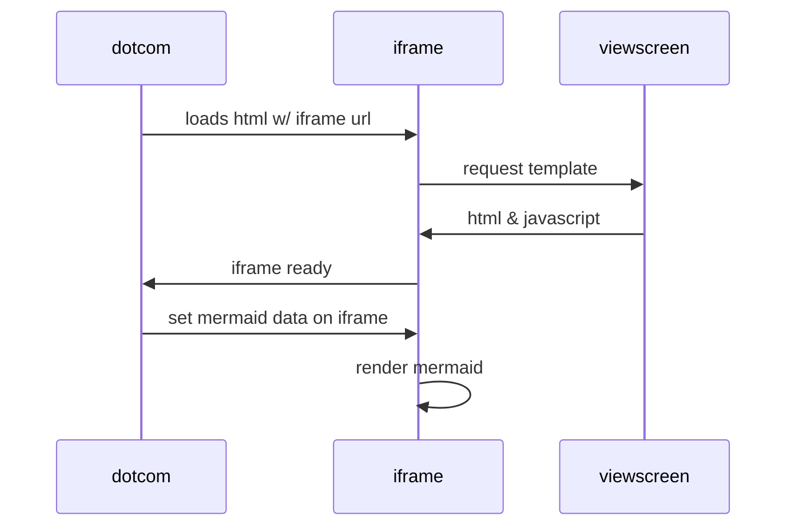
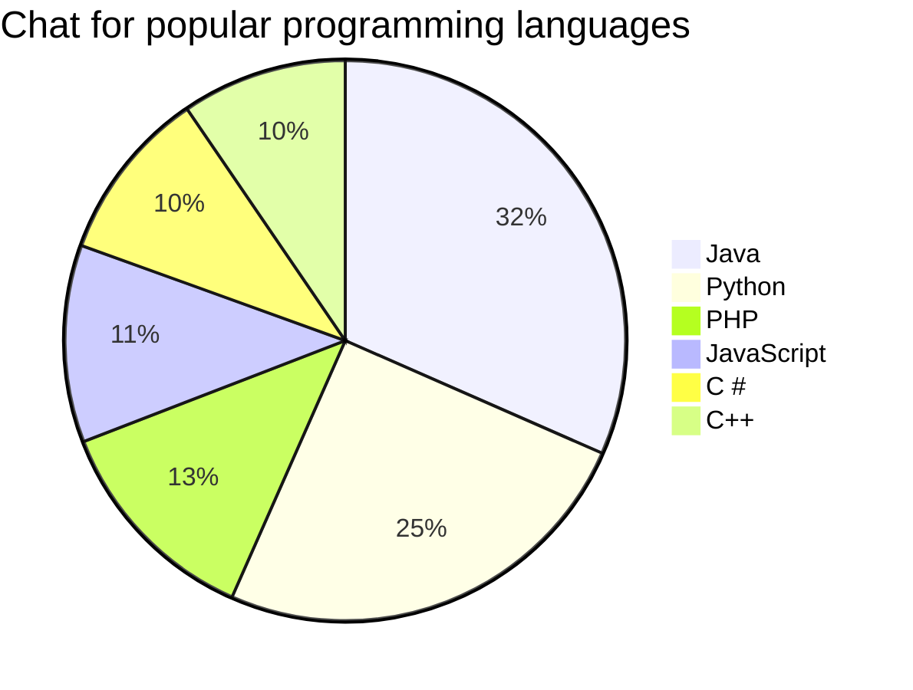

<!-- # マークダウンで書いたページ

人生は、生きてるだけで丸儲け、争わない、楽しみ、チャレンジするそれで、人の役に立てれば最高!

## 中野信子氏「生きてるだけで丸儲け」は生物学的にも正しい

脳科学を通して伝えたいことはシンプルで「生きている者が勝ち！」ということです。

ほとんどの生物の目的というのは「生き延びること」と「子孫を残すこと」なんですね。

ですが人間だけはそうではない。「ひと花咲かせよう！」みたいなのがあって、これがすごい特異的なんですよ。本当は生き延びて生殖するために脳ができたんですけど、でもその脳が発達しすぎてしまったがために「ひと花咲かせよう！」ができちゃうわけです。

## Youtube Video
<iframe width="560" height="315" src="https://www.youtube.com/embed/RJkjFIcBqNU" title="YouTube video player" frameborder="0" allow="accelerometer; autoplay; clipboard-write; encrypted-media; gyroscope; picture-in-picture" allowfullscreen></iframe>
 -->
 
## 目次
* [概要](#chapter1)
* [順序](#chapter2)
* [詳細](#chapter3)

### 概要
    - 日本の挨拶についてまとめる

### 挨拶の順序
    1. おはようございます。
    2. こんにちは。
    3. こんばんは。

### 詳細
    1. 「おはようございます」とは  
    起床時、あるいは朝人に会った時の挨拶。
    2. 「こんにちは」とは  
    語源は「今日は、ご機嫌いかがですか？」が省略されたもの
    3. 「こんばんは」とは  
    語源は「今晩は〇〇ですね。」の後半部分が省略されたもの
    

<!-- 
 -->
